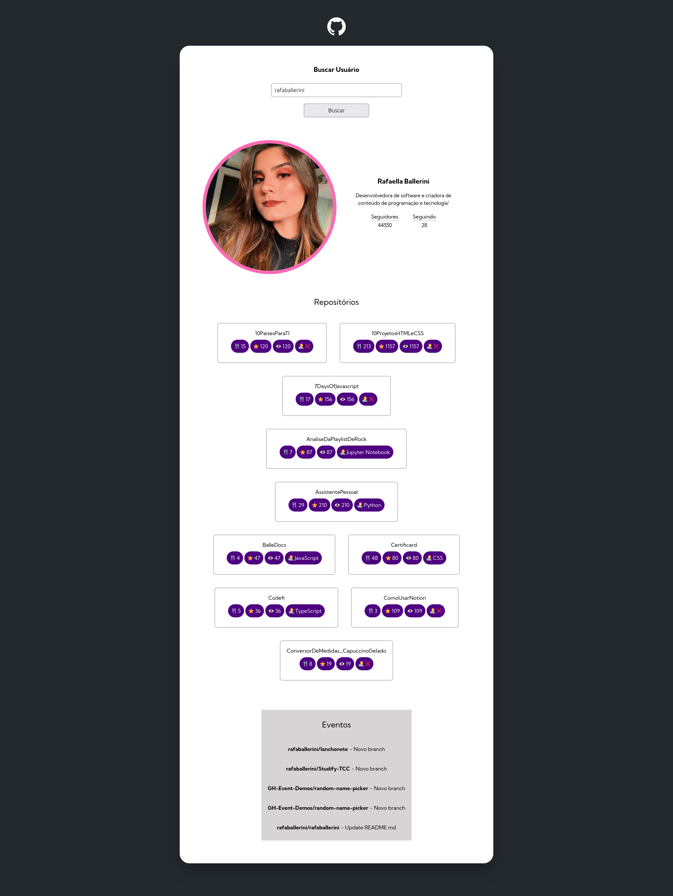
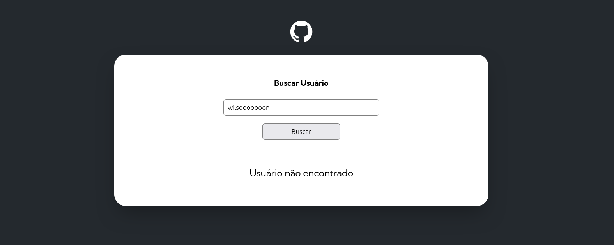

# GitHub API

O projeto é um desafio frontend proporcionado pelo Dev em Dobro, ele faz uso da API proporcionada pelo GitHub, o sistema realiza requisição baseado no nome digitado pelo usuário, dessa forma ele traz informações do usuário como: Nome completo, seguidores, seguindo, repositórios, informações sobre repositórios e eventos

## Tecnologias Utilizadas

- HTML
- CSS
- JS
- GitHub API

## Preview

### Tela inicial

### Pesquisando usuáro

### Usuário não existente

